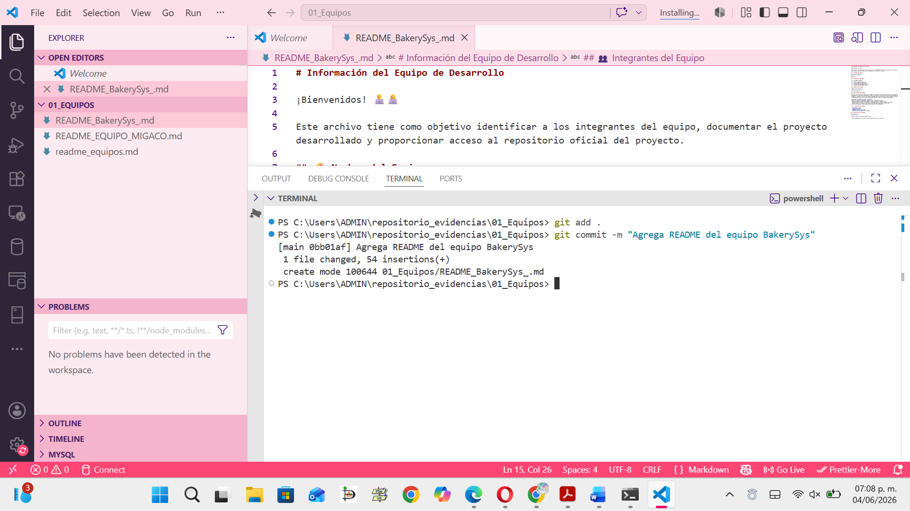

# Información del Equipo de Desarrolloo

¡Bienvenidos! 👨‍💻👩‍💻

Este archivo tiene como objetivo identificar a los integrantes del equipo, documentar el proyecto desarrollado y proporcionar acceso al repositorio oficial del proyecto.

## 🏷️ Nombre del Equipo

**Nombre del equipo:**

BakerySys

## 👥 Integrantes del Equipo

| No. | Nombre completo |
|-----|-----------------|
| 1 | Paola Jaqueline López Mata |
| 2 | Gerardo Manzano Villafaña |
| 3 | Jennifer Ailin Medina Hernández |
| 4 | Mildred Mariana Banda López |

## 💡 Nombre del Proyecto

**Nombre del proyecto:**

Aplicación BakerySys

## 📖 Descripción del Proyecto

BakerySys es una solución digital para panaderías y negocios de productos horneados que automatiza y centraliza la gestión de inventario, ventas y alertas de reorden. Sustituye los métodos manuales (cuadernos, hojas de cálculo) para reducir pérdidas por falta de control, evitar quiebres de stock y proporcionar datos para la toma de decisiones mediante reportes de ventas exportables.

**¿Qué hace el proyecto de forma concreta?**
- Registra productos terminados (nombre, precio, cantidad inicial).
- Registra ventas con descuento automático del inventario en tiempo real.
- Gestiona materias primas con umbrales mínimos para emitir alertas visuales de reorden.
- Genera reportes de ventas por período (día/semana/mes) exportables a PDF o CSV.
- Controla acceso por roles (administrador/dueño y cajero/vendedor).

## 🛠️ Tecnologías Utilizadas

- **Frontend:** React
- **Backend:** Node.js
- **Base de datos:** PostgreSQL
- **Control de versiones:** Git, GitHub

## 🔗 Repositorio del Proyecto

**Repositorio:**

https://github.com/PaolaLpez/Panader-a.git

> *Nota: Reemplazar con la URL real del repositorio una vez creado.*

