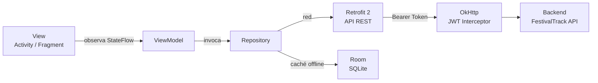

# 🎵 FestivalTrack — AgendaCultural

## 🚀 Información del Equipo de Desarrollo

¡Bienvenidos! 👨‍💻👩‍💻

Este archivo tiene como objetivo identificar a los integrantes del equipo, documentar el proyecto
desarrollado y proporcionar acceso al repositorio oficial del proyecto.

---

## 🏷️ Nombre del Equipo

**Equipo_JAJ**

---

## 👥 Integrantes del Equipo

| No. | Nombre completo               | Número de control |
|-----|-------------------------------|-------------------|
| 1   | Chavero Martínez Noé          | 1223100837        |
| 2   | Cruz Méndez Juan Gustavo Ángel| 1223100406        |
| 3   | Salinas Salinas Omar          | 1223100433        |

---

## 💡 Nombre del Proyecto

**FestivalTrack**

---

## 📖 Descripción del Proyecto

FestivalTrack es una aplicación Android nativa desarrollada en Kotlin que centraliza todas las
interacciones del usuario con el Festival José Alfredo Jiménez, evento cultural de gran
relevancia en Dolores Hidalgo, Guanajuato. El sistema atiende a tres perfiles de usuario:
asistentes presenciales, aficionados remotos y administradores del festival. Permite el registro
y autenticación de usuarios, la compra de boletos con generación de código QR, la exploración
de una biografía interactiva, la transmisión en vivo en calidad mínima de 720p y un panel de
administración para gestión de contenido. La arquitectura adoptada es MVVM con el stack
Retrofit 2 + Kotlin Coroutines + Jetpack.

---

## 🛠️ Tecnologías Utilizadas

| Tecnología              | Rol en el proyecto                                      |
|-------------------------|---------------------------------------------------------|
| Kotlin                  | Lenguaje principal de desarrollo Android                |
| Android Studio          | IDE de desarrollo                                       |
| Retrofit 2              | Cliente HTTP tipado para consumo de la API REST         |
| OkHttp                  | Engine HTTP y manejo de interceptores JWT               |
| Kotlin Coroutines       | Programación asíncrona sin callbacks                    |
| Jetpack ViewModel       | Capa de lógica de presentación lifecycle-aware          |
| LiveData / StateFlow    | Patrón Observer reactivo y lifecycle-aware              |
| Room                    | Base de datos local SQLite para caché offline           |
| Hilt (Dagger)           | Inyección de dependencias                               |
| ExoPlayer / Media3      | Reproductor de streaming HLS adaptativo                 |
| Coil                    | Carga asíncrona de imágenes                             |
| JWT (JSON Web Token)    | Autenticación sin estado en todas las llamadas a la API |
| Git / GitHub            | Control de versiones y colaboración                     |

---

## 🏗️ Arquitectura del Proyecto

---

## 📋 Requerimientos Funcionales

| ID    | Descripción                                                                                  |
|-------|----------------------------------------------------------------------------------------------|
| RF-01 | El sistema deberá permitir el registro de usuarios mediante correo y contraseña.             |
| RF-02 | El sistema deberá autenticar usuarios mediante JWT con HTTPS obligatorio.                    |
| RF-03 | El sistema deberá permitir la compra de boletos con selección de fecha, categoría y asiento. |
| RF-04 | El sistema deberá generar un código QR válido al completar una compra de boleto.             |
| RF-05 | El sistema deberá mostrar la biografía interactiva de José Alfredo Jiménez con galería.      |
| RF-06 | El sistema deberá reproducir audios y mostrar una línea de tiempo biográfica.                |
| RF-07 | El sistema deberá ofrecer transmisión en vivo mediante protocolo HLS adaptativo.             |
| RF-08 | La transmisión en vivo deberá mantener una calidad mínima de 720p vía ExoPlayer.             |
| RF-09 | El sistema deberá contar con un panel de administración para subir canciones e imágenes.     |
| RF-10 | Las actualizaciones del panel de administración deberán reflejarse de forma inmediata en la app. |
| RF-11 | El sistema deberá funcionar con disponibilidad 24/7, con reconexión automática ante pérdida de señal. |
| RF-12 | El sistema deberá ser compatible con Android API Level 26 (Android 8.0) en adelante.        |

---

## 💪 Fortalezas del Proyecto

1. **Arquitectura MVVM sólida** — separación clara entre UI, lógica de presentación y datos, siguiendo el estándar oficial de Google para Android.
2. **Disponibilidad offline garantizada** — el patrón Repository con Room permite servir datos cacheados sin conexión a internet, satisfaciendo la restricción de disponibilidad 24/7.
3. **Autenticación JWT centralizada** — el OkHttp Interceptor inyecta el Bearer Token en todas las peticiones desde un único punto, facilitando cambios futuros en la estrategia de autenticación.
4. **UI reactiva sin memory leaks** — el uso de LiveData/StateFlow lifecycle-aware previene fugas de memoria incluso en sesiones largas como la transmisión en vivo.
5. **Stack oficial y bien documentado** — Retrofit 2 + Jetpack cuenta con amplia documentación de Google, codelabs y comunidad activa, lo que reduce la curva de aprendizaje del equipo.
6. **Escalabilidad del sistema de plugins** — la arquitectura permite agregar nuevas funcionalidades (notificaciones push, mapas, pagos) sin modificar los repositorios existentes.

---

## 🔧 Oportunidades de Mejora

1. **Migración futura a Kotlin Multiplatform (KMP)** — si el proyecto escala a iOS o Desktop, el módulo de red puede extraerse a un módulo `:shared` KMP, reutilizando lógica entre plataformas.
2. **Implementación de Refresh Token automático** — actualmente el interceptor JWT puede extenderse con un `OkHttp Authenticator` para renovar tokens expirados sin intervención del usuario.
3. **Cobertura de pruebas unitarias** — el patrón Repository facilita el uso de `FakeRepository` en tests del ViewModel; incrementar la cobertura reducirá regresiones en futuras iteraciones.
4. **Internacionalización (i18n)** — el contenido del festival actualmente asume español; agregar soporte multi-idioma ampliaría el alcance a aficionados internacionales de José Alfredo Jiménez.
5. **Modo de accesibilidad** — implementar descripciones de contenido (`contentDescription`) y soporte para lectores de pantalla mejoraría la experiencia para usuarios con discapacidad visual.

---

## 🔗 Repositorio del Proyecto

**Repositorio:** [https://github.com/SekiroK5/AgendaCultural](https://github.com/SekiroK5/AgendaCultural)

**Documentación del PID:** [https://omarsalinas3.github.io/omarsalinas3.github.iofestivaltrack-android-docs/](https://omarsalinas3.github.io/omarsalinas3.github.iofestivaltrack-android-docs/)

---

*Universidad Tecnológica del Norte de Guanajuato — Ingeniería en Desarrollo y Gestión de Software*
*Desarrollo Web Integral — Grupo GIDS6092 — Mayo 2026*