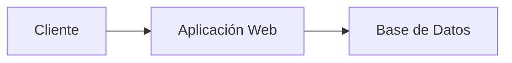

# 🚀 Práctica 03: Contribución a un Proyecto Open Source mediante Fork y Pull Request

## 🎯 Objetivo

Aplicar un flujo de trabajo profesional utilizando Git y GitHub mediante la creación de un Fork de un repositorio Open Source, la clonación del repositorio personal, la creación de una rama de desarrollo, la modificación de documentación técnica y la generación de un Pull Request.

---

# 📚 Competencias a desarrollar

Al finalizar la práctica el estudiante será capaz de:

* Realizar Forks de proyectos Open Source.
* Clonar repositorios remotos.
* Crear y administrar ramas.
* Modificar documentación en Markdown.
* Registrar cambios mediante commits.
* Sincronizar repositorios locales y remotos.
* Crear Pull Requests.
* Aplicar flujos de colaboración profesional.

---

# 🌐 Repositorios sugeridos

Seleccione uno de los siguientes proyectos:

| Proyecto            | URL                                             |
| ------------------- | ----------------------------------------------- |
| Next.js             | https://github.com/vercel/next.js               |
| Gatsby              | https://github.com/gatsbyjs/gatsby              |
| Refine              | https://github.com/refinedev/refine             |
| WebArena            | https://github.com/Anadee11/WebArena            |
| Simple WebApp Flask | https://github.com/mmumshad/simple-webapp-flask |

---

# 🏢 Escenario

Has sido invitado a colaborar en un proyecto Open Source.

El equipo de desarrollo solicita mejorar la documentación para facilitar la incorporación de nuevos desarrolladores.

Las modificaciones se realizarán exclusivamente sobre el archivo:

```text
README.md
```

---

# 🔀 Parte 1. Realizar Fork

1. Ingresar al repositorio seleccionado.
2. Presionar el botón:

```text
Fork
```

3. Crear una copia en su cuenta personal de GitHub.

Resultado esperado:

```text
Repositorio Original
        ↓
      Fork
        ↓
Repositorio Personal
```

Ejemplo:

```text
vercel/next.js
        ↓
usuario/next.js
```


---

# 📥 Parte 2. Clonar el Fork

Clonar el repositorio que se encuentra en su cuenta personal.

```bash
git clone https://github.com/USUARIO/REPOSITORIO.git
```

Ejemplo:

```bash
git clone https://github.com/jose/next.js.git
```

Ingresar al proyecto:

```bash
cd REPOSITORIO
```

Verificar:

```bash
git status
```


---


# 🌿 Parte 3. Crear rama de desarrollo

Crear una rama llamada:

```text
dev
```

```bash
git checkout -b dev
```

Verificar:

```bash
git branch
```

Resultado esperado:

```text
* dev
  main
```


---

# 🔗 Parte 4. Configurar repositorio original (upstream)

Agregar referencia al proyecto original.

```bash
git remote add upstream URL_REPOSITORIO_ORIGINAL
```

Ejemplo:

```bash
git remote add upstream https://github.com/vercel/next.js.git
```

Verificar:

```bash
git remote -v
```

Resultado esperado:

```text
origin    https://github.com/usuario/next.js.git
upstream  https://github.com/vercel/next.js.git
```


---

# 📝 Parte 5. Modificar README.md

Agregar la siguiente sección:

```markdown
# Student Contribution

## Developer Information

- Name:
- University:
- Date:

## Proposed Improvements

1.
2.
3.

## Observations

Lorem ipsum...
```


---

# 🎯 Parte 6. Actividades obligatorias

*Estas son sobre el Proyecto a realizar en equipo*

## 🏆 Actividad A. Fortalezas del proyecto

Agregar:

```markdown
## Project Strengths
```

Describir al menos 5 fortalezas.

---

## 🔧 Actividad B. Oportunidades de mejora

Agregar:

```markdown
## Improvement Opportunities
```

Describir al menos 5 oportunidades de mejora.

---

## 📊 Actividad C. Tabla Markdown

Agregar una tabla de tecnologías utilizadas.

---

## 🗺️ Actividad D. Diagrama Mermaid

Agregar un diagrama de arquitectura.

Ejemplo:

````markdown

````

---

## 📋 Actividad E. Requerimientos funcionales

Definir al menos 10 requerimientos funcionales.

Ejemplo:

```text
RF-01 El sistema deberá permitir el registro de usuarios.
RF-02 El sistema deberá permitir la autenticación de usuarios.
```


---

# 💾 Parte 7. Registrar cambios

Agregar cambios:

```bash
git add README.md
```

Crear commit:

```bash
git commit -m "docs: improve project documentation"
```

Verificar:

```bash
git log --oneline
```


---

# ☁️ Parte 8. Publicar cambios

Enviar la rama al Fork personal.

```bash
git push origin dev
```


---

# 🔄 Parte 9. Sincronizar con proyecto original

Actualizar desde el repositorio principal.

```bash
git checkout main

git fetch upstream

git merge upstream/main
```

Regresar a la rama de trabajo:

```bash
git checkout dev
```

---


# 🔀 Parte 10. Crear Pull Request

Ingresar a GitHub.

Seleccionar:

```text
Compare & Pull Request
```

Configuración:

```text
Base Repository:
Repositorio Original

Base Branch:
main

Head Repository:
Fork Personal

Compare Branch:
dev
```

Título:

```text
Improve README documentation
```

Descripción:

```markdown
## Changes

- Added contributor information
- Added strengths analysis
- Added improvement opportunities
- Added Mermaid diagram
- Added functional requirements

## Evidence

README updated successfully.
```

Enviar Pull Request.


https://github.com/mmumshad/simple-webapp-flask/pull/78

# https://github.com/mmumshad/simple-webapp-flask/pull/78


---


# 🏅 Reto adicional

Crear una segunda rama:

```bash
git checkout -b feature/profile
```

Agregar una nueva sección:

```markdown
## Team Members
```

Realizar:

```bash
git add .
git commit -m "feat: add team members section"
git push origin feature/profile
```

Generar Pull Request:

```text
feature/profile → dev
```


---

# 📖 Comandos utilizados

```bash
git clone
git remote
git remote add
git fetch
git branch
git checkout
git status
git add
git commit
git push
git merge
git log
```

---

# 📊 Criterios de evaluación

| Criterio                  | Valor |
| ------------------------- | ----: |
| Fork del repositorio      |   15% |
| Configuración de upstream |   10% |
| Uso de rama dev           |   15% |
| Modificaciones al README  |   30% |
| Pull Request              |   20% |
| Evidencias                |   10% |

## 🎯 Calificación Total

**100 puntos**

