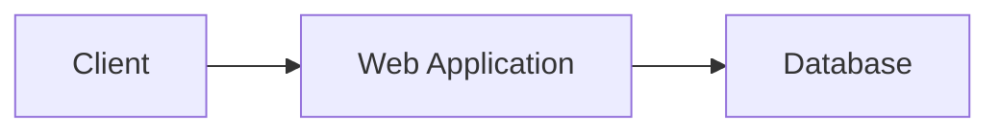

# 🚀 Práctica 01: Contribución a un Proyecto Open Source mediante Pull Request

> 💡 **Objetivo:** Aplicar un flujo de trabajo profesional utilizando Git y GitHub mediante la clonación de un repositorio real, la creación de una rama de desarrollo, la modificación de documentación en Markdown y la generación de un Pull Request.

---

## 🎯 Competencias a desarrollar

Al finalizar la práctica el estudiante será capaz de:

* ✅ Clonar repositorios remotos.
* ✅ Crear y administrar ramas.
* ✅ Modificar archivos Markdown.
* ✅ Registrar cambios mediante commits.
* ✅ Sincronizar repositorios locales y remotos.
* ✅ Crear Pull Requests.
* ✅ Aplicar buenas prácticas de colaboración.

---


## 📚 Repositorios sugeridos

| 🌐 Proyecto | 🔗 URL                                           |
| ----------- | ------------------------------------------------ |
| Next.js     | https://github.com/vercel/next.js                |
| Gatsby      | https://github.com/gatsbyjs/gatsby               |
| Refine      | https://github.com/refinedev/refine              |
| Open edX    | https://github.com/openedx/frontend-app-learning |
| Kana Dojo   | https://github.com/lingdojo/kana-dojo            |

---

## 🧩 Escenario

Usted ha sido incorporado temporalmente al equipo de desarrollo de un proyecto Open Source.

Su misión consiste en mejorar la documentación técnica del proyecto para facilitar la incorporación de nuevos desarrolladores.

> ⚠️ Todas las modificaciones deberán realizarse exclusivamente sobre el archivo `README.md`.

---

# 🛠️ Parte 1. Clonación del repositorio

### Paso 1. Clonar el proyecto

```bash
git clone URL_DEL_REPOSITORIO
```

### Paso 2. Ingresar al proyecto

```bash

cd nombre-del-proyecto

```

### Paso 3. Verificar estado

```bash
git status
```

---

# 🌿 Parte 2. Creación de la rama de desarrollo

Crear una nueva rama llamada:

```text
dev
```

```bash
git checkout -b dev
```

Verificar:

```bash
git branch
```

Resultado esperado:

```text
* dev
  main
```

---

# 📝 Parte 3. Modificación del README

Agregar la siguiente sección:

```markdown
# Student Contribution

## Developer Information

- Name:
- University:
- Date:

## Proposed Improvements

1.
2.
3.

## Observations

Lorem ipsum...
```

---

# 🎯 Parte 4. Actividades obligatorias

## 🏆 Actividad A. Fortalezas del proyecto

Agregar:

```markdown
## Project Strengths
```

Describir:

* ⭐ Fortaleza 1
* ⭐ Fortaleza 2
* ⭐ Fortaleza 3
* ⭐ Fortaleza 4
* ⭐ Fortaleza 5

---

## 🔧 Actividad B. Oportunidades de mejora

Agregar:

```markdown
## Improvement Opportunities
```

Describir:

* 🔹 Mejora 1
* 🔹 Mejora 2
* 🔹 Mejora 3
* 🔹 Mejora 4
* 🔹 Mejora 5

---

## 📊 Actividad C. Tabla Markdown

```markdown
| Technology | Purpose         |
|------------|-----------------|
| React      | Frontend        |
| Node.js    | Backend         |
| GitHub     | Version Control |
```

---

## 🗺️ Actividad D. Diagrama Mermaid

````markdown

````

---

## 📋 Actividad E. Requerimientos funcionales

Agregar:

```markdown
## Functional Requirements
```

Ejemplo:

```text
RF-01 El sistema deberá permitir el registro de usuarios.
RF-02 El sistema deberá permitir la autenticación de usuarios.
```

Mínimo: **10 requerimientos funcionales.**

---

# 💾 Parte 5. Registro de cambios

```bash
git add README.md
```

Verificar:

```bash
git status
```

---

# 📌 Parte 6. Commit

```bash
git commit -m "docs: improve project documentation"
```

Verificar:

```bash
git log --oneline
```

---

# ☁️ Parte 7. Publicación de cambios

```bash
git push origin dev
```

---

# 🔄 Parte 8. Actualización de la rama

```bash
git checkout main
git pull origin main

git checkout dev
git merge main
```

---

# 🔀 Parte 9. Creación del Pull Request

Configurar:

```text
Base Branch: main
Compare Branch: dev
```

Título:

```text
Improve README documentation
```

---

# 📸 Evidencias a entregar

## 📍 Evidencia 1

```bash
git branch
```

## 📍 Evidencia 2

```bash
git status
```

## 📍 Evidencia 3

```bash
git log --oneline
```

## 📍 Evidencia 4

```bash
git remote -v
```

## 📍 Evidencia 5

Captura del Pull Request.

## 📍 Evidencia 6

URL del Pull Request.

---

# 🏅 Reto adicional (Puntos Extra)

Crear una rama:

```bash
git checkout -b feature/profile
```

Agregar una sección:

```markdown
## Team Members
```

Posteriormente:

```bash
git add .
git commit -m "feat: add team members section"
git push origin feature/profile
```

Generar Pull Request:

```text
feature/profile → dev
```

---

# 📖 Comandos Git utilizados

```bash
git clone
git status
git branch
git checkout
git add
git commit
git push
git pull
git merge
git log
```

---

# 📊 Criterios de evaluación

| Criterio                     | Valor |
| ---------------------------- | ----- |
| 🚀 Clonación del repositorio | 10%   |
| 🌿 Creación de rama dev      | 15%   |
| 📝 Modificaciones al README  | 30%   |
| 📌 Uso correcto de commits   | 15%   |
| 🔀 Pull Request              | 20%   |
| 📸 Evidencias                | 10%   |

## 🎯 Calificación Total


**100 puntos**

---

> 💡 **Consejo profesional:** Realiza commits frecuentes, utiliza mensajes descriptivos y verifica siempre el estado del repositorio mediante `git status` antes de realizar un push.
